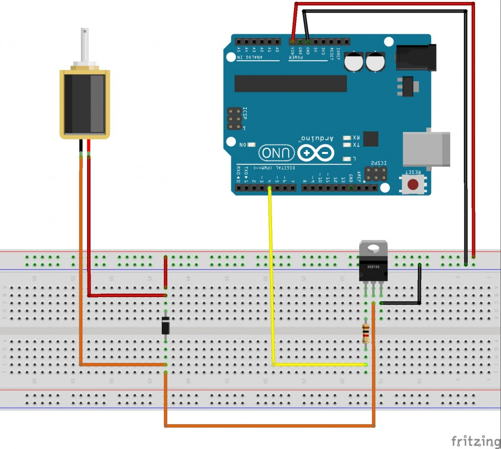

# Shrey and Henry's Elves (SHelves)

This is out Engineering 2 Final Project. We're building a secret bluetooth safe. Essentially, the "secret" comes from the fact that it's not going to look anything like a safe, andd will seem like another random 3d printed object. The lock will be controlled by sending a password through bluetooth, so we can only enter it.

---

## Table of Contents

* [Project Pre-Planning](#Project-Pre-Planning)
* [Weekly Targets](#Weekly-Targets)
* [Final Project Documentation](#Final-Project-Documentation)
* [Final Project Documentation - Code(with tips)](#Code)
* [Final Project Documentation - CAD(with tips)](#CAD)

---

## Project Pre-Planning

### Pre-Planning Links

Here are some links for our project pre-planning

[Project Pre-Planning Document](https://docs.google.com/document/d/1n7HKKgamwmxf23o07j7cTV_iTXT8w2us0Eivl7ezHLk/edit)

[Onshape Document](https://cvilleschools.onshape.com/documents/396c4bae165363b393b80903/w/f6e132cf290feae134ab5437/e/f283a3afb2df00d231ba4060) - We made a basic design of our project in Onshape so we can get an idea of how it is going to look and where all the components would be in the final product.

### Pseudocode

This is out initial basic thought of what we want our code to do, but it's in words. If you're wondering why it's talking about NFCs, that's because we were actually going to make this a secret NFC safe, but we changed it to bluwtooth for various reasons(look at Week 2 summary for details)

```c++
void setup() {
    
}

void loop() {
    read nfc
    verify legetimatcy of NFC
    send data back
    if nfc is correct
    {release lock}
    
    if nfc is incorrect 
    {send message back and capture hacker}
}
```
### Purchase Documents

[Finances Spreadsheet](https://docs.google.com/spreadsheets/d/1NeZBrL9gGg3-wpjZcSCkW1YLsva8NJrKapRebr1HqUg/edit#gid=0)

[Things to buy](https://docs.google.com/document/d/1pShio0aneYviQ_E5x2Q9ebDooaYmQixlLznzhgxQQnk/edit)

*Note: Documents are pretty informal right now. Will start to cement as time goes on*

### CAD Designs

Some STL files in the repo:
[CADFiles](https://github.com/shrey45/Shrey-and-Henry-s-Elves-SHelves-/tree/main/CADfiles)

Link to Onshape Document
[It's above, but here's it again](#pre-planning-links)

---

## Weekly Targets

<details>
    
### Week 1 - 2/22/21

#### Goal

Our goal for this week is to figure how the Arduino works**

#### Week 1 Summary

We got our parts and we opened up the Arduino. The arduino that we purchased is the Arduino 33 BLE w/headers. Honestly speaking, we have no idea how to operate this thing. We have used Arduino Uno for the entirity of our "enginnering career". We have to do A LOT of research on how this arduino nano works, and how we can get it to pair with NFC. We can normally look on Google for projects similar to ours, and get ideas and inspiration, but apparently no one has done a project using Arduino Nano + NFC. Someone's got to do it sooo... I guess that's us. We researched a dew sites and used the [Arduino Reference on BLE](https://www.arduino.cc/en/Reference/ArduinoBLE) so we could learn more about it. 

**Goal Status - In progress**

#### Links used

(https://www.okdo.com/project/get-started-with-arduino-nano-33-ble) - Just visiting sites to learn more

[Arduino Reference on BLE](https://www.arduino.cc/en/Reference/ArduinoBLE)

---

### Week 2 - 3/1/21

#### Goal

Our goal is to continue working on our NFC research.

**Goal Status -**

#### Week 2 Summary

We had a major FAIL and breakthrough this week. We realized that the arduino we bought doesn't actually have a NFC reader, it's just a chip. That kind of defeated the purpose of having the arduino nano w/nfc. Our breakthrough was that we were able to use BLE instead of NFC. We slightly modified our project to be a bluetooth based compartment rather than NFC based. What happens is that when the arduino nano connects to our device through NRF connect, the box will unlock. We got that working rather easily, and also decided we wanted to have a step 2 for the unlcoking process. We haven't thought of that step though.

#### Links Used

(https://www.okdo.com/project/get-started-with-arduino-nano-33-ble) - Just visiting sites to learn more

[Arduino Reference on BLE](https://www.arduino.cc/en/Reference/ArduinoBLE)

---

### Week 3 - 3/8/21

#### Goal

Our goal is to figure out what a second step to unlocking the compartment.

**Goal Status -**

#### Week 3 Summary

We thought of stating in the code hat if only a registered device connects through BLE, then the box will open. That way other devices that randomly connect can't get in. I looked around the BLE function library and found a function called scanForAddress(). That was to scan for the bluetooth address that the Nano is connecting to. I played around with that for a bit but for some wierd reason, the adress that was popping up on my serial monitor was completely different from what my device's address was. In the end, it eneded up not working how I wanted it to, but I'll kepp working on it.

#### Links Used

[scanForAddress()](https://www.arduino.cc/en/Reference/ArduinoBLEBLEscanForAddress)

[Arduino Reference on BLE](https://www.arduino.cc/en/Reference/ArduinoBLE)

[Arduino Forums](https://forum.arduino.cc/index.php?topic=662680.0)

---

### Week 4 - 3/15/21

#### Goal

Our goal is to figure out what a second step to unlocking the compartment.

**Goal Status -**

#### Week 4 Summary

Honestly, we didn't get much progress in code this week. Still trying to work out how to add a second layer of security and other things. I also was bombarded with a lot of HW including and essay, so... yeah. Next week will be much more productive for code. We did get some prgress in CAD though! Chek out the [CADFiles](https://github.com/shrey45/Shrey-and-Henry-s-Elves-SHelves-/tree/main/CADfiles)

—

Yep, not too much. We have a good direction, just getting concepts to real things can be hard. Very hard. CAD was tweaked to be better printed.

#### Links Used

[Arduino Forums](https://forum.arduino.cc/index.php?topic=662680.0)

[Onshape link](https://cvilleschools.onshape.com/documents/396c4bae165363b393b80903/w/f6e132cf290feae134ab5437/e/29a0a14830e85418dcbea46b)

[Onshape link 2](https://cvilleschools.onshape.com/documents/c71da7297e82db234daa5424/w/67425958a3b815c674c77b8b/e/1645d67e4368d60fb1fd7d67)


---

### Week 6 - 3/31/21

#### Goal

Continue to troubleshoot Arduino <-> Device connection, and prepare CAD design for real world use.

**Goal Status - CAD is going slow, but okay. Code is running into issues.**

#### Week 6 Summary

CAD: Thickness of box has been changed, many small redesigns to fit a battery and mechanisms. Trying to design 'snap-fit' (2 links below) for the box top and bottom walls.

Code: Between the Arduino Nano, the Bluetooth Low Energy (BLE) protocol, and the walled garden of iOS, the knowledge and code that exists for this project is very very rare. Troubleshooting is being done very actively, it's just hard to keep constantly mulling over to try and find *el Dorado*.

**Once we get back from Spring Break**

Henry: First off, I'm gonna bask in the lab air. Then, I'm gonna work and hopefully start getting some locking prototypes started, maybe printing out our designs. I 100% will have a million questions, but hopefully I can try and find the answers myself.

Shrey: I'll still be at home, but I'm gonna be following the sane drill. Write, test, rewrite, and retest code. I'm just tying to figure out this code, and I'm really close, I know it. That's why it's so frustrating because I can see the light at the end of the tunnel, but it's still about a mile away.

#### Links Used

[Latest Onshape Document (Snap-fit Compartment Design)](https://cvilleschools.onshape.com/documents/6b8f4263bb016b629e189fe7/w/23d0a2824c42f47f874adfcc/e/d084e0d6af6d5dfb90115ced)

[Snap-fit Article #1](https://www.sculpteo.com/blog/2018/04/25/how-to-connect-two-parts-with-3d-printed-joints-and-snap-fits/)

[Snap-fit Article #2](https://www.3dhubs.com/knowledge-base/how-design-snap-fit-joints-3d-printing/)

[Henry's Random Links](https://github.com/shrey45/Secret-Bluetooth-Compartment/blob/main/CADfiles/RandomLinks.md)
    
</details>

## Final Project Documentation

<details>

### Summary

We initially chose the Nano 33 Ble because we saw it had NFC capabilities, and it way tiny, so we purchased that, but switching from that to bluetooth led us to a lot of problems. Eventually though, after a lot of struggles, trial and error runs, and testing, we finished the box. Kind of, atleast. We finished the theoretical proof of concept of the box, designed it completely on CAD, AND completed & tested working code, but we were unable to get the box printed because of shortage of time. Whatever we got though is pretty cool and we're happy about it! (not really we're pretty bummed out that we couldn't actually make it after lots of effort and time...) Here it is though!
    
#### Materials Used

- Arduino Nano 33 BLE
- Solenoid
- Diode
- Transistor
- Resistor
- Jumper Wires

Here are some tips for starting any project:

#### Project Tips

1. Research properly - Make aure you know about 90% of everything in your project. It's not possible to knwo EVERYTHING that you will need, because problems will arise and you'll have to work around it, but have a really good sense of it.
2. Read electronic parts' documentation - This is very helpful. You can understand all about the board, and most of the features.
3. Read carefully - This goes back to the research. Just because you see one word that you were looking for, doesn't mean it's exactly what you're looking for. Read on to make sure it isn't some other thing that would be kind of useless for your work(Kind of like if you see a sign for lemonade, but they wrote "no lemons were harmed in the making" in fine print, so you basically just wasted 50 cents on yellow colored water)
4. Whenever you're testing code and using your board, remember - *NEVER RUN A 9V BATTERY THROUGH YOUR NANO, IT WILL GET FRIED*(backed by real life evidence).


### Code

```c++

#include <ArduinoBLE.h>

BLEService ledService("19B10000-E8F2-537E-4F6C-D104768A1214"); // BLE LED Service

// BLE LED Switch Characteristic - custom 128-bit UUID, read and writable by central
BLEByteCharacteristic switchCharacteristic("19B10001-E8F2-537E-4F6C-D104768A1214", BLERead | BLEWrite);

const int ledPin = LED_BUILTIN; // pin to use for the LED

void setup() {
  Serial.begin(9600);
  while (!Serial);

  // set LED pin to output mode
  pinMode(ledPin, OUTPUT);

  // begin initialization
  if (!BLE.begin()) {
    Serial.println("starting BLE failed!");

    while (1);
  }

  // set advertised local name and service UUID:
  BLE.setLocalName("LED");
  BLE.setAdvertisedService(ledService);

  // add the characteristic to the service
  ledService.addCharacteristic(switchCharacteristic);

  // add service
  BLE.addService(ledService);

  // set the initial value for the characeristic:
  switchCharacteristic.writeValue(0);

  // start advertising
  BLE.advertise();

  Serial.println("BLE LED Peripheral");
}

void loop() {
  // listen for BLE peripherals to connect:
  BLEDevice central = BLE.central();

  // if a central is connected to peripheral:
  if (central) {
    Serial.print("Connected to central: ");
    // print the central's MAC address:
    Serial.println(central.address());

    // while the central is still connected to peripheral:
    while (central.connected()) {
      // if the remote device wrote to the characteristic,
      // use the value to control the LED:
      if (switchCharacteristic.written()) {
        if (switchCharacteristic.value()) {   // any value other than 0
          Serial.println("LED off");
          digitalWrite(ledPin, LOW);         // will turn the LED off
        } else {                              // a 0 value
          Serial.println(("LED on"));
          digitalWrite(ledPin, HIGH);          // will turn the LED on
        }
      }
    }

    // when the central disconnects, print it out:
    Serial.print(("Disconnected from central: "));
    Serial.println(central.address());
    
  }
}
```
    
*Wiring*:



#### Reflection

---

Our time with the code was litteraly a rollercoaster ride. We had times that we felt that we were almost done, but we stumbled upon a huge problem right after. Sometimes, it felt like we couldn't even get past the most basic things. At some points, we struggled to get code just uploading to the board(hit the reset button), and we took at least 2 weeks searching for an app that can send inputs via BLE. We actually started with NFC, but then realized we bought a board that had an NFC chip on it, and not a reader, so that was an obstacle we created on ourselves and that probably wasted a good bit of time. Eventually though, the code issue was solved. 

Here are some tips for working with Bluetooth, or any new complicated feature:

#### Tips for Bluetooth(or any new things you're trying out)

1. Make sure you know what you intend on using Bluetooth for before starting your project - Knwoing this will make planning a lot easier.
2. Explore different options before making a choice of equiment or purchase - We used a Nano 33 BLE, and that added to the complexity of our project because this was a fairly new board, and there weren't many helfpful resources while trying to fully understand it. A great option for starting out on bluetooth could be to try using an [HC-05 Bluetooth Module](https://www.amazon.com/HiLetgo-Wireless-Bluetooth-Transceiver-Arduino/dp/B071YJG8DR) which work with Arduino Uno, and has plenty of resources online. It also has many apps that are compatible with it.
3. If you do end up using BLE - start by reading through and applying code and functions found on the [Arduino BLE Library Reference Page](https://www.arduino.cc/en/Reference/ArduinoBLE) so that you can start to get a feel for BLE, and how it works.
4. Download the BLE library and try out the example codes - Use the serial monitor to your advantage and start messing with some code. This will help you understand how to implement these codes, with other BLE functions, to your project code.
5. [LightBlue](https://apps.apple.com/us/app/lightblue/id557428110) - This app is one of the only apps that can communicate with(send inputs) to the Nano. Another great app to start of with is [nRF Connect](https://apps.apple.com/us/app/nrf-connect-for-mobile/id1054362403), which allows you to test code and make sure it connects(*NOTE: This app can only connect to the Nano, but not send it inputs*). Download these apps on your phone, and start messing around with it.
6. Example Code - Here's a link to [another Repo](https://github.com/shrey45/Secret-Bluetooth-Compartment/blob/main/APPS%20with%20BLE%20CODE.md) about the codes to use for the apps above.
7. Try to start reading functions - The codes that I provided you proably don't make any sense, and look like another language(actually it is😂), and thats what I felt at the start too. If you look over the reference page I linked though then you can start making sense of the code. So try to go over the hugh code 1 line at a time, and see if you can get the jist of what everything means. TRUST ME. It'll be A LOT easier then.
8. Do as much Google as you can to try to get informatin from the very few sources there are online.
9. *Last Resort Option* - Worst comes worst, after checking with your teacher and if there are no resources available to help you continue in your BLE(or whatever project) adventure, then write a support ticket to Arduino. I'm not going to link that because you probably shouldn't use that... because you have THIS AMAZING RESOURCE WHICH GIVES YOU SO MUCH INFORMATION!!! I wish I had something like this before this project...
10. It will be very frustrating, trust me, but *DO NOT* give up. 
11. This is not really related to code, but whenever you're testing code and using your board, remember - *NEVER RUN A 9V BATTERY THROUGH YOUR NANO, IT WILL GET FRIED*(backed by real life evidence).

I really hope this section of code advice helps and you don't keep on goin in circles like we did for the entire year(but you should struggle and fail, it helps in the learning process:)

ON TO CAD!➡️

## CAD
  

[SnapFit.md](SnapFit.md)  
[SnapFit Onshape](https://cvilleschools.onshape.com/documents/f3440d5da847d046bf1eb953/w/08b36d4511e8e49777525b57/e/3e4783c8b1288a5ddce265f7)

 
    
[OldCompartmentDesign Onshape](https://cvilleschools.onshape.com/documents/396c4bae165363b393b80903/w/f6e132cf290feae134ab5437/e/29a0a14830e85418dcbea46b)  
[CompartmentRedesign Onshape](https://cvilleschools.onshape.com/documents/c71da7297e82db234daa5424/w/67425958a3b815c674c77b8b/e/6f854c8b8a0eb32d950fda1c)  
[SnapFitCompartmentDesign Onshape](https://cvilleschools.onshape.com/documents/6b8f4263bb016b629e189fe7/w/23d0a2824c42f47f874adfcc/e/b8b8692039fcbf42eb6f0b4a)  
[NoneSpeakerLeftBeef Onshape (Final design)](https://cvilleschools.onshape.com/documents/9ee71173f84ed46c57a5b318/w/1ce86f572c7f2d8ddb705cc3/e/54a1578b72b67c68f9d880e9) 
